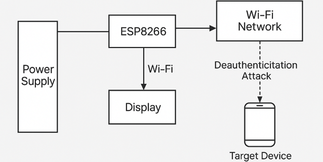
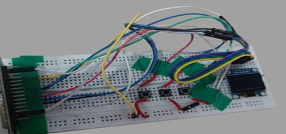
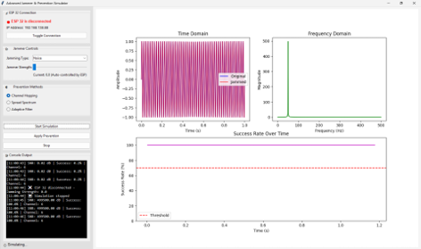
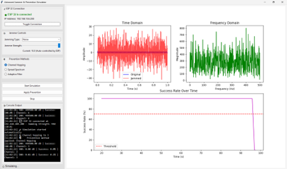

# ESP32 Wireless Network Monitoring and Analysis System

Simple, low-cost ESP32 project for Wi-Fi monitoring, analysis, and controlled 2.4 GHz interference research.

## Key Highlights

- Low-cost Wi-Fi experimentation platform built around the ESP32 Wi-Fi module.
- Can block/disrupt 2.4 GHz Wi-Fi activity in authorized, controlled test environments using the onboard ESP32 radio, without requiring a high-cost external antenna setup.
- OLED + desktop dashboard workflow for live observation and analysis.
- Built for embedded systems learning, demonstrations, and research validation.


## Table of Contents

- [Overview](#overview)
- [Repository Structure](#repository-structure)
- [Features](#features)
- [System Architecture](#system-architecture)
- [Hardware Setup](#hardware-setup)
- [Dashboard Monitoring](#dashboard-monitoring)
- [Methodology](#methodology)
- [Results](#results)
- [Future Enhancements](#future-enhancements)
- [References](#references)
- [Author](#author)
- [Image Placement Guide](#image-placement-guide)

## Overview

The **ESP32 Wireless Network Monitoring and Analysis System** is an educational embedded-systems project designed to observe nearby Wi-Fi activity, present live signal metrics on a compact OLED interface, and visualize wireless behavior on a desktop dashboard. The system combines ESP32 firmware, user input buttons, display output, and offline analysis tools to create a complete end-to-end wireless monitoring workflow.

This project is suitable for a final-year mini project, embedded systems portfolio, or internship showcase because it demonstrates:

- ESP32 firmware development
- Wi-Fi scanning and frame-level monitoring concepts
- OLED user-interface design
- Human-machine interaction with push buttons
- Desktop signal visualization
- Time-domain and frequency-domain analysis

## Repository Structure

```text
ESP32-WiFi-Network-Analyzer/
├── README.md
├── src/
│   ├── firmware source code
│   └── ESP32 application logic
├── hardware/
│   ├── wiring notes
│   ├── schematic files
│   └── prototype documentation
├── dashboard/
│   └── desktop visualization and analysis tools
├── docs/
│   ├── 21ECC322L-mini%20project%20proposal%20form.pdf
│   ├── minor ppt 2.pdf
│   └── README.md
└── images/
    ├── hardware-prototype.jpg
    ├── dashboard-no-noise.png
    ├── dashboard-with-noise.png
    ├── README.md
    └── block-diagram.png
```

This structure is intentionally split into firmware, hardware documentation, dashboard analytics, and visual assets so the repository looks clear, professional, and easy to evaluate. If you keep supporting media in the `images/` folder and submission documents in `docs/`, the repository will remain easy to navigate for recruiters, professors, and reviewers.

## Features

- **Wi-Fi scanning**: Detects nearby wireless networks and displays SSID, RSSI, and channel information.
- **Packet monitoring**: Uses ESP32 promiscuous mode concepts to observe wireless frame activity and network behavior.
- **2.4 GHz test capability**: Supports controlled interference/jamming simulation scenarios for lab research and defensive testing on authorized networks.
- **OLED visualization**: Presents key status information on a 0.96-inch SSD1306 display.
- **Dashboard analytics**: Visualizes signal patterns, packet activity, and statistical trends on a desktop dashboard.
- **Real-time statistics**: Shows live updates that make the system useful for demonstrations and experimentation.
- **Button-driven interaction**: Enables menu navigation and control using push buttons.
- **Embedded systems integration**: Combines sensing, display output, user input, and analysis in one compact platform.

## Legal and Ethical Note

Use any interference or jamming-related features only in legal, controlled, and explicitly authorized test setups (for example, shielded labs or approved research environments). Do not use these features on public, third-party, or production networks.

## System Architecture



*Figure 1. High-level system architecture showing the ESP32, OLED interface, push-button controls, wireless observation pipeline, and desktop analysis dashboard.*

The architecture is organized into four layers:

1. **Sensing layer** - The ESP32 scans wireless activity and collects signal-related metrics.
2. **Interaction layer** - Push buttons provide user navigation and control.
3. **Presentation layer** - The OLED display shows live device and network status.
4. **Analysis layer** - The dashboard processes and visualizes signal behavior in both time and frequency domains.

## Hardware Setup

**Figure 3. Circuit Diagram Placeholder**

*Add the exported circuit diagram as `images/circuit-diagram.png` and place it here once the wiring diagram is finalized.*



*Figure 6. Physical hardware prototype assembled on a breadboard for the ESP32-based monitoring system.*

### OLED Wiring

| OLED Pin | ESP32 Connection |
| --- | --- |
| VCC | 3.3V |
| GND | GND |
| SDA | GPIO 21 |
| SCL | GPIO 22 |

### Push-Button Wiring

| Button | ESP32 GPIO | Function |
| --- | --- | --- |
| OK | GPIO 13 | Confirm / select |
| UP | GPIO 14 | Navigate upward |
| DOWN | GPIO 12 | Navigate downward |

### Hardware Notes

- Power the system from a stable USB supply to ensure clean ESP32 startup.
- Keep I2C wiring short to reduce display communication noise.
- Use pull-up or pull-down logic consistent with the firmware configuration.
- Mount the OLED in a visible position for live debugging and demo scenarios.

## Dashboard Monitoring



*Figure 4. Desktop dashboard view under low-interference or clean-signal conditions.*



*Figure 5. Desktop dashboard view under higher-interference or noisier wireless conditions.*

The desktop dashboard is used to observe wireless behavior beyond the OLED display. It complements the embedded interface by offering larger plots and easier comparison of signal trends over time.

### Time-Domain Analysis

The time-domain view is used to study signal amplitude and packet-related fluctuations as they evolve across time. It helps identify:

- signal stability
- burst-like activity
- amplitude variation
- interference patterns

### Frequency-Domain Analysis

The frequency-domain view helps reveal how the observed wireless activity is distributed across frequency components. It is useful for understanding:

- spectral concentration
- spread caused by interference
- peak activity regions
- comparative noise conditions

The dashboard is especially useful for demonstrating how the same wireless environment can look different when clean and when affected by higher background noise or stronger channel activity.

## Methodology

### 1. Hardware Initialization

The ESP32 boots, initializes the OLED display, configures input buttons, and prepares the wireless interface for scanning and monitoring.

### 2. Network Scanning

Nearby Wi-Fi networks are detected and basic metadata such as SSID, RSSI, and channel number are collected for display and analysis.

### 3. Packet Monitoring

Wireless activity is observed using ESP32 monitoring capabilities so that frame-level behavior and traffic intensity can be studied during experiments.

### 4. Dashboard Visualization

Collected observations are rendered on the desktop dashboard to present time-domain and frequency-domain views, along with status charts and statistics.

### 5. User Interaction

The push buttons provide a simple embedded UI for navigating screens, confirming selections, and controlling the presentation flow.

## Results

The project demonstrates that a compact ESP32 system can be used to create a practical wireless monitoring demo with both embedded and desktop interfaces.

### Observations

- The OLED display is effective for compact, glanceable status feedback.
- The dashboard makes wireless behavior much easier to interpret than a small display alone.
- Button-based navigation keeps the user interaction simple and reliable.

### Performance Analysis

- In cleaner conditions, the dashboard shows a more stable time-domain response and a more concentrated frequency-domain pattern.
- Under noisier conditions, the signal becomes more dispersed and the plots show higher variability.
- The comparison highlights how interference and busy wireless environments affect observable signal behavior.

### Comparative Summary

| Condition | Time-Domain Behavior | Frequency-Domain Behavior | Overall Interpretation |
| --- | --- | --- | --- |
| Low-noise / clean environment | More stable and consistent | More concentrated spectral response | Better readability and lower variability |
| Higher-noise / busy environment | More fluctuating and irregular | Wider spread and higher background activity | Greater interference and reduced clarity |

## Future Enhancements

- Mobile application integration for remote monitoring
- Data logging for historical analysis and reporting
- Enhanced analytics with trend detection and alerts
- External antenna support for broader observation range
- Exportable CSV/JSON logs for research validation
- Web-based dashboard deployment for easier access

## References

1. Espressif Systems, **ESP32 Technical Reference Manual**.
2. Espressif Systems, **ESP32 Wi-Fi API and SDK Documentation**.
3. SSD1306 OLED display documentation and I2C interfacing guides.
4. Wireless networking references on RSSI, channel utilization, and spectrum analysis.
5. Academic and project references used for embedded signal visualization and packet monitoring concepts.

## Author

**Amit Chauhan**  
B.Tech Student  
SRM Institute of Science and Technology


